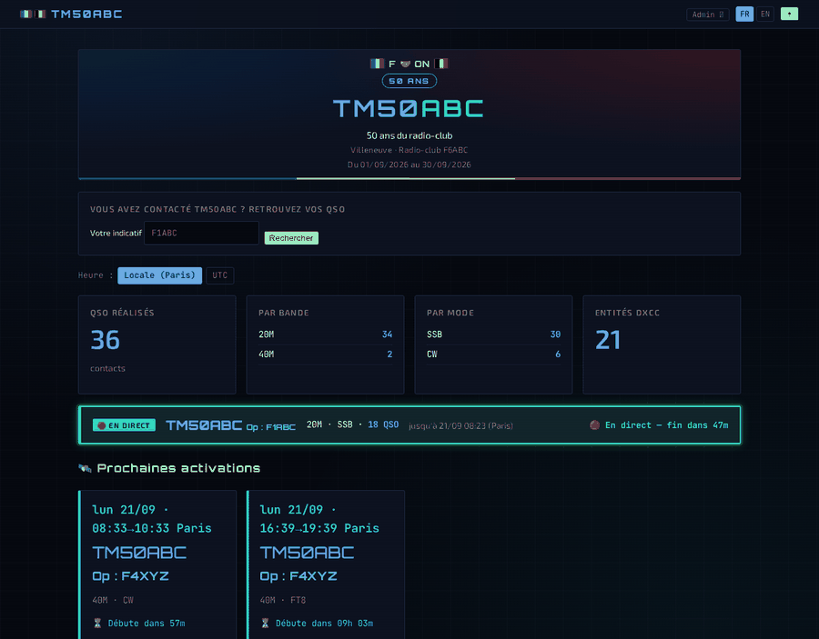
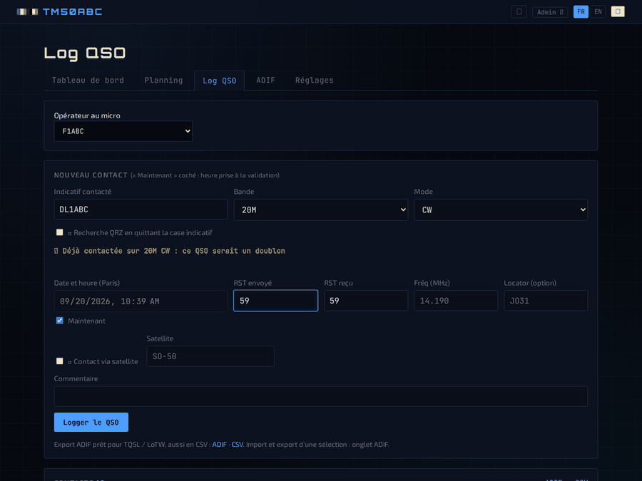
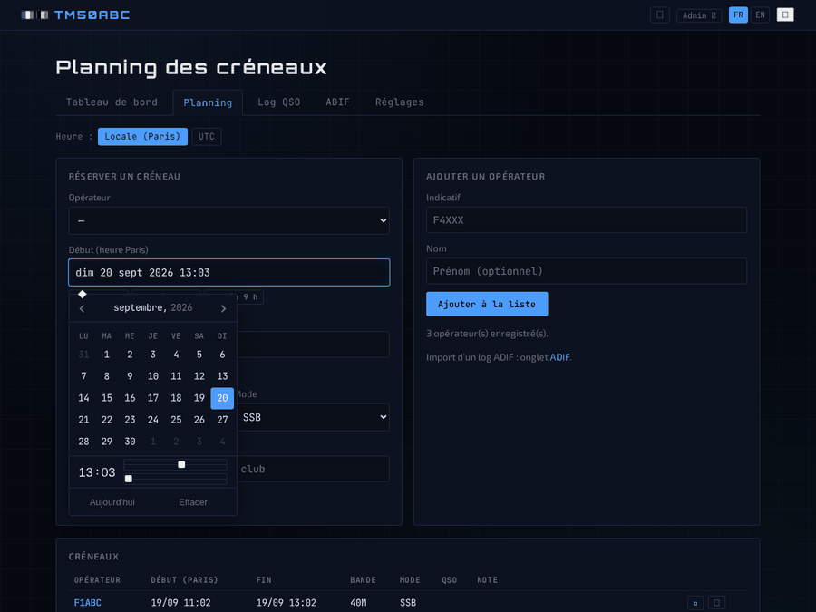
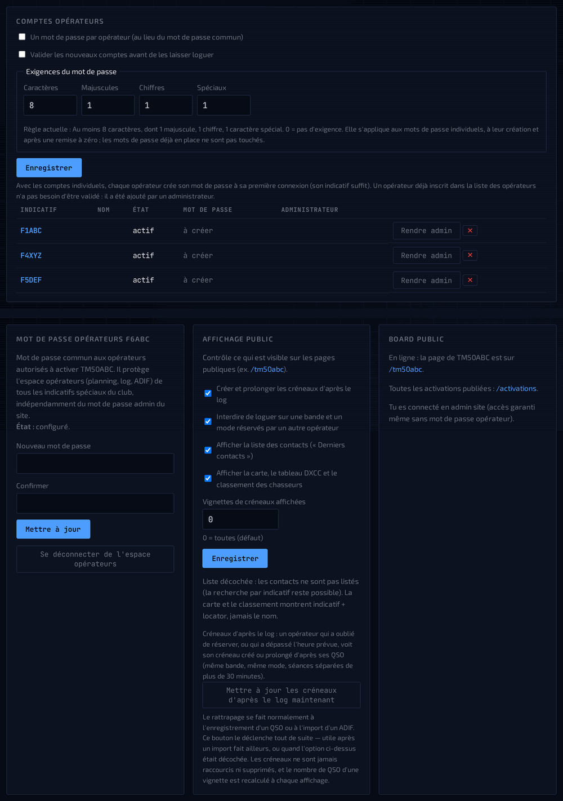
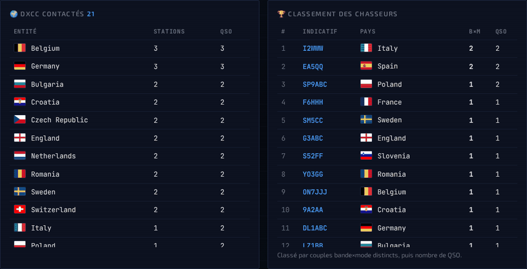
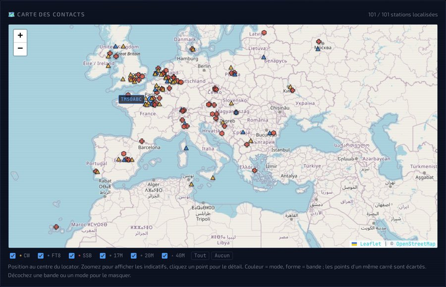

*English version: [README.en.md](README.en.md) (guides too: `docs/*.en.md`)*

# TM Activation

**Le club active un indicatif spécial ? Voici de quoi tenir le planning, le log
et la page publique, sans rien installer chez personne.**

Application web pour l'activation d'**indicatifs spéciaux** radioamateur (TM…,
TO…, etc.) par un radio-club : chaque opérateur réserve ses créneaux et logue
ses QSO depuis son téléphone ou son PC, et les chasseurs suivent l'activation
en direct sur une page publique.



- **Planning partagé** : qui trafique, quand, sur quelle bande et quel mode,
  avec alerte de chevauchement, comptes à rebours et bilan de chaque créneau.
- **Log QSO multi-opérateurs** : saisie rapide, heure « maintenant », doublons
  signalés dès l'indicatif tapé, recherche QRZ, mode satellite, **jauges de
  cadence** (QSO/h et 10 min, avec la tendance), **panneau des spots DX**
  (« suis-je spotté ? ») et **drapeaux des pays contactés** qui s'ajoutent au
  fil des QSO.
- **ADIF** : import avec aperçu, export complet ou d'une sélection, prêt pour
  TQSL / LoTW.
- **Page publique** pour les chasseurs : activations en cours et à venir, carte
  des contacts, tableau DXCC avec les drapeaux (sans compte QRZ), classement aux
  points et recherche « suis-je dans le log ? ».
- **Comptes opérateurs** au choix : un mot de passe commun, ou un par opérateur
  avec validation facultative et plusieurs administrateurs.
- **Français et anglais**, au choix du visiteur.

Elle s'installe en quelques minutes sur un **Raspberry Pi**, un **conteneur
Proxmox** ou un serveur Linux, et fonctionne de façon autonome — y compris sur
un réseau local **sans Internet** (bibliothèques, polices, calendrier et
drapeaux embarqués ; seuls le fond de carte, la recherche QRZ et les spots DX
demandent une connexion).

La page de log, pendant une activation : créneau en cours, spots DX, cadence
du moment, pays déjà contactés et carnet à côté de la saisie.



| Planning des créneaux | Réglages (les options) |
|---|---|
|  |  |





Développée par Olivier F4IOZ, puis extraite de son site pour être partagée
avec les radio-clubs.

## Téléchargement

Code source et dernières versions : **<https://github.com/f4ioz/tm-activation>**

- Archive zip : <https://github.com/f4ioz/tm-activation/raw/main/releases/tm-activation-1.26.0.zip>
- Archive tar.gz : <https://github.com/f4ioz/tm-activation/raw/main/releases/tm-activation-1.26.0.tar.gz>
- Empreintes SHA-256 et versions précédentes : dossier
  [`releases/`](https://github.com/f4ioz/tm-activation/tree/main/releases)

Si le Pi a accès à Internet, l'archive peut être téléchargée directement dessus :

```bash
wget https://github.com/f4ioz/tm-activation/raw/main/releases/tm-activation-1.26.0.tar.gz
```

## Fonctionnalités

- **Espace opérateurs** (`/activation`), protégé par un mot de passe commun :
  chaque opérateur se connecte avec son indicatif.
  - **Comptes opérateurs (au choix)** : mot de passe commun à tous, ou **un mot
    de passe par opérateur**, créé à sa première connexion (l'indicatif suffit).
    Le mot de passe doit faire 8 caractères avec une majuscule, un chiffre et un
    caractère spécial, et une **question anti-robot** (calcul simple, sans service
    extérieur) protège la création de comptes. La validation des nouveaux comptes
    par un administrateur est facultative, et plusieurs opérateurs peuvent être
    **administrateurs**. Réglages → Comptes opérateurs.
  - **Chacun sur son indicatif** : un opérateur qui n'est pas coché
    « administrateur » logue, réserve ses créneaux, importe et exporte sous le
    seul indicatif donné à la connexion, et ne peut ni modifier ni supprimer les
    QSO et les créneaux des autres — avec un mot de passe par opérateur comme
    avec le mot de passe commun. Il voit le log complet de la station — utile
    pour repérer les doublons — mais ses exports ne contiennent que ses propres
    QSO. Avec le mot de passe commun, c'est un garde-fou contre les erreurs de
    saisie, pas une barrière : qui connaît le mot de passe peut se reconnecter
    sous un autre indicatif. Les administrateurs, eux, gardent la main sur tout,
    et les Réglages exigent toujours un mot de passe personnel (ou celui du
    site).
  - **Planning** des créneaux (qui, quand, bande, mode), avec alerte si deux
    créneaux se chevauchent sur la même bande, comptes à rebours et **nombre de
    QSO loggés** dans chaque créneau (même opérateur, même bande, même mode) ;
    rien n'est affiché tant qu'aucun QSO n'est enregistré, le log n'ayant
    peut-être pas encore été importé. Les dates et heures se choisissent dans un
    **calendrier** avec réglage de l'heure au curseur et des **raccourcis**
    (Maintenant, Ce soir 20 h, Demain 9 h, +1 h/+2 h/+4 h) ; déplacer le début
    déplace la fin en gardant la durée. Sans Internet, un calendrier simple
    embarqué prend le relais ; sur téléphone, c'est le sélecteur du mobile.
  - **Le log rattrape les oublis** : un opérateur qui trafique sans avoir
    réservé voit son créneau créé d'après ses QSO, et celui qui dépasse l'heure
    prévue voit le sien prolongé. La page de log affiche les **créneaux du
    moment**, celui de l'opérateur connecté mis en avant.
  - **Pas deux stations à la fois** sur la même bande et le même mode : si un
    autre opérateur a réservé, la saisie est signalée en rouge et le QSO est
    refusé (réglage désactivable).
  - **Log QSO** rapide : heure « maintenant », détection des doublons, recherche
    QRZ (nom, locator, pays), mode satellite. Dès l'indicatif saisi, l'écran dit
    si la **station a déjà été contactée** : jamais vue, déjà au log (avec les
    bandes/modes et la date du dernier QSO), ou **doublon** sur la bande et le
    mode choisis ; les QSO faits sous un autre indicatif du club sont signalés
    à part.
  - **Jauges de cadence** : à côté de « Opérateur au micro », côte à côte, le
    nombre de QSO de la dernière heure et des 10 dernières minutes, la cadence
    ramenée à l'heure, la flèche de tendance (▲ / ▼ par rapport à la période
    précédente) et deux jauges qui passent au vert quand ça décolle — de
    « station calme » à « pile-up ! ». Mis à jour à chaque QSO enregistré.
  - **Le carnet reste sous les yeux** : sur un écran large, la saisie est à
    gauche et les derniers QSO à droite, visibles pendant qu'on logue ; la page
    est resserrée pour qu'une dizaine de lignes tiennent sans défiler.
  - **Suis-je spotté ?** : les trois derniers spots DX de l'indicatif **sur la
    bande et le type de trafic en cours** (DXWatch, puis HamQTH en secours)
    s'affichent à côté des jauges, avec la fréquence, le spotteur et
    l'ancienneté ; un clic sur la fréquence la reprend dans le formulaire.
    Changer de bande ou de mode change les spots : le cluster ne donne pas le
    mode, il est lu dans le commentaire du spot (« CQ LSB », « FT8 -06db »)
    puis, à défaut, dans le plan de bande. Sans Internet, le panneau disparaît,
    sans erreur.
  - **Pays contactés** : les drapeaux des entités DXCC déjà travaillées
    s'ajoutent à chaque QSO enregistré, le plus récent en tête (déduits du
    préfixe de l'indicatif, vignettes servies par l'application : aucun accès
    réseau nécessaire, et l'affichage est le même sous Windows, Android ou
    Linux). Les entités DXCC séparées le restent : la Corse, les Canaries, la
    Sicile, Madère, l'Alaska ou Kaliningrad comptent pour elles-mêmes, avec
    leur propre drapeau, au même titre que la Guadeloupe ou la Guyane.
  - **ADIF** : import en deux temps (aperçu des nouveaux QSO, des doublons et des
    lignes invalides, puis confirmation) et export complet ou d'une sélection,
    prêt à signer avec TQSL pour LoTW. Export CSV.
- **Page publique** par indicatif (`/tm50abc`) : activations en direct et à
  venir, carte des stations contactées, tableau **DXCC avec les drapeaux**,
  classement des chasseurs (règle de points réglable), recherche « suis-je dans
  le log ? ». L'entité DXCC est déduite du préfixe de l'indicatif : le tableau
  et les drapeaux sont justes dès le premier QSO, **même sans compte QRZ** —
  QRZ, quand il est configuré, précise le nom officiel de l'entité. Les noms
  des stations contactées ne sont jamais publiés.
- **Plusieurs indicatifs spéciaux** : un seul « en cours » à la fois, les
  précédents restent consultables (`/activations`).
- **Chacun à son heure** : « Locale » affiche les heures dans le fuseau du
  **visiteur**, annoncé par son navigateur — un chasseur canadien lit les
  créneaux à son heure sans rien régler, et les heures qu'il saisit sont
  comprises dans son fuseau. Bouton **Heure : Locale / UTC** dans les pages, et
  UTC partout dans la base et l'ADIF. Sans JavaScript, c'est le fuseau de la
  station (`site.timezone` de `config.yml`) qui sert de repère.
- **Français / English** : chaque page s'affiche dans la langue du navigateur
  (anglais pour les chasseurs étrangers), avec un bouton **FR | EN** dans le
  bandeau ; le choix est mémorisé. L'installeur pose la question au démarrage
  (ou `--lang en`). Traductions : `app/locales/en.json` pour les pages,
  `deploy/lang/en.sh` pour l'installeur.
- **Sauvegardes automatiques** de la base (au démarrage et après chaque
  modification), téléchargeables depuis les Réglages.
- **Sécurité** : blocage des essais de mots de passe et des robots scanneurs,
  en-têtes de sécurité, pages opérateurs non indexées. Une page de
  **surveillance** (`/admin/surveillance`, administrateur) montre le journal des
  connexions, les IP aux essais répétés et les robots bloqués.

### Options (Réglages)

Tout est activable ou désactivable depuis **Réglages** (administrateur) : rien
n'est imposé.

| Option | Par défaut | Effet |
|---|---|---|
| Un mot de passe par opérateur | non | chacun son compte au lieu du mot de passe commun |
| Valider les nouveaux comptes | non | un administrateur approuve avant la première connexion |
| Créer et prolonger les créneaux d'après le log | oui | rattrape les oublis de réservation |
| Recaler les créneaux sur le log maintenant | bouton | rattrapage immédiat, même option décochée |
| Vignettes de créneaux affichées | toutes | ou un nombre maximum sur la page publique |
| Interdire de loguer sur une bande et un mode réservés | oui | évite deux stations à la fois |
| Afficher la liste des contacts | au choix | « Derniers contacts » sur la page publique |
| Afficher carte, DXCC et classement | au choix | la partie « chasseurs » de la page publique |
| Classement aux points | non | sinon classement aux couples bande × mode |
| Couleurs et formes de la carte | oui | une couleur par mode, une forme par bande (réglables) |
| Filtres bande/mode sur la carte | oui | cases à cocher pour n'afficher que ce qui intéresse |
| Compte QRZ.com | facultatif | noms, locators et pays des stations contactées |
| Heure locale ou UTC | locale | l'heure locale est **celle du visiteur**, mémorisée |
| Langue FR / EN | navigateur | bouton dans le bandeau, mémorisé |

## Trois façons de l'utiliser

| | Réseau local | Internet par votre box | Internet par Cloudflare Tunnel |
|---|---|---|---|
| Pour qui | opérateurs sur place | chasseurs et opérateurs, de partout | idem, sans toucher à la box |
| Accès | `http://<nom-machine>.local` | `https://<votre-domaine>` | `https://<votre-domaine>` |
| Nom de domaine | non | oui | oui, géré par Cloudflare |
| Ports à ouvrir | aucun | 80 et 443 sur la box | aucun |
| IPv4 publique dédiée | non | nécessaire | non (marche en 4G, IPv4 partagée) |
| Installation | `sudo ./install.sh --lan` | `sudo ./install.sh --domain tm.mon-club.fr --email vous@exemple.fr` | `sudo ./install.sh --tunnel --domain tm.mon-club.fr` |
| Détails | ci-dessous | [docs/internet-raspberry-pi.md](docs/internet-raspberry-pi.md) | [docs/cloudflare-tunnel.md](docs/cloudflare-tunnel.md) |

Lancé sans option, `sudo ./install.sh` est une **installation guidée**. Elle
pose d'abord toutes les questions (utilisation, domaine, box, indicatif, club,
mots de passe) et affiche un récapitulatif **avant toute modification**. En
mode Internet, elle guide ensuite le réglage de la box (Freebox, Livebox, SFR,
Bbox), avec l'adresse et la MAC du Pi. Elle vérifie aussi le DNS, puis fait un
essai à blanc chez Let's Encrypt avant de demander le vrai certificat, et
explique la cause en cas d'échec.

## Matériel et système

- **Raspberry Pi** 3, 4, 5 ou Zero 2 W, avec une carte microSD de 16 Go ou
  plus, et **Raspberry Pi OS Lite 64 bits** (Bookworm ou plus récent). La
  version 32 bits fonctionne aussi.
- Ou tout **serveur Linux** : Debian 12/13, Ubuntu 22.04 ou plus récent.
- Python 3.11 ou plus récent : c'est la version fournie par ces systèmes.
  Raspberry Pi OS Bullseye et Debian 11 sont trop anciens.
- **Accès Internet pendant l'installation** : paquets Debian et Python. Tout
  est précompilé pour les processeurs du Raspberry Pi, rien n'est compilé sur
  place.
- Facultatif : un compte QRZ.com avec **abonnement XML** pour les noms,
  locators et pays des stations contactées (à saisir à l'installation ou,
  plus tard, dans **Réglages → Callbook QRZ**).

L'application occupe environ 80 Mo de mémoire.

## Installation sur Raspberry Pi, pas à pas

1. Avec **Raspberry Pi Imager**, graver *Raspberry Pi OS Lite (64-bit)*. Dans
   les réglages de l'Imager, choisir le **nom de la machine** (ex. `tm50abc` :
   ce sera l'adresse `http://tm50abc.local`), l'utilisateur et le mot de passe,
   le Wi-Fi si besoin, et **activer SSH**.
2. Démarrer le Pi, puis s'y connecter depuis un PC du même réseau :
   `ssh utilisateur@tm50abc.local`
3. Copier l'archive sur le Pi, depuis le PC :
   `scp tm-activation-1.26.0.tar.gz utilisateur@tm50abc.local:`
   (ou la télécharger directement sur le Pi avec `wget`, voir
   [Téléchargement](#téléchargement))
4. Sur le Pi :

   ```bash
   tar xzf tm-activation-1.26.0.tar.gz
   cd tm-activation-1.26.0
   sudo ./install.sh --lan
   ```

   Depuis le zip (envoi par mail, passage par Windows) :

   ```bash
   unzip tm-activation-1.26.0.zip
   cd tm-activation-1.26.0
   sudo bash install.sh --lan
   ```

   Le script installe ce qui manque (Python, avahi), pose quelques questions
   (indicatif, locator, club, mots de passe) et démarre le service.
5. Ouvrir **http://tm50abc.local/** depuis un téléphone ou un PC du même
   réseau. Si l'adresse `.local` ne répond pas (certains Android ou Windows
   anciens), utiliser l'adresse IP affichée à la fin de l'installation.

Le service redémarre tout seul à chaque mise sous tension du Pi.

### Heure du Raspberry Pi

**Important pour le log** : le Raspberry Pi n'a pas d'horloge sauvegardée. À
chaque démarrage, il remet son heure à jour par Internet (NTP). Sans Internet,
son heure est fausse, et les QSO saisis avec « Maintenant » le sont aussi.

- Avec Internet au démarrage (box, partage de connexion d'un téléphone), rien
  à faire.
- Sans Internet : utiliser un **Raspberry Pi 5** avec sa pile d'horloge (prise
  RTC), ou un module horloge RTC (DS3231) sur les autres modèles. À défaut,
  mettre le Pi à l'heure à la main après chaque démarrage :
  `sudo date -u -s "2026-09-20 14:05"` (heure UTC).
- Contrôle : `timedatectl`. L'installeur prévient si l'horloge n'est pas
  synchronisée.

### Sans Internet

Sur un réseau local sans Internet, **tout fonctionne** : planning, log, ADIF,
page publique, sauvegardes. Les bibliothèques et polices des pages sont
fournies par l'application elle-même. Seuls manquent :

- le **fond de carte** OpenStreetMap : les stations restent placées, sur fond
  vide ;
- les **recherches QRZ** : elles se font automatiquement au retour d'Internet,
  pour tous les indicatifs déjà loggés ;
- les **spots DX** : le panneau « suis-je spotté ? » disparaît simplement de la
  page de log.

Les **drapeaux des pays contactés**, eux, ne demandent rien : l'entité DXCC est
déduite du préfixe de l'indicatif et les vignettes sont servies par
l'application.

## Installation sur Proxmox VE (conteneur LXC)

Sur un serveur **Proxmox VE**, une seule commande crée un conteneur Debian
dédié, télécharge la dernière version depuis GitHub (empreinte SHA-256
vérifiée) et l'installe. Dans le **Shell du nœud** Proxmox, en root :

```bash
bash -c "$(curl -fsSL https://raw.githubusercontent.com/f4ioz/tm-activation/main/proxmox/tm-activation-lxc.sh)"
```

Le script demande les caractéristiques du conteneur (ID, nom, disque 4 Go,
1 vCPU, 512 Mo de RAM, stockage, réseau DHCP ou IP fixe, mot de passe root,
clé SSH facultative), puis propose :

1. **Installation guidée** : les questions habituelles de TM Activation
   (réseau local, Internet par la box avec HTTPS, ou Cloudflare Tunnel ;
   indicatif, club, mots de passe). En mode Internet par la box, les ports 80
   et 443 sont à rediriger vers l'IP du conteneur.
2. **Test rapide** : réseau local, sans question, indicatif `TM0TEST`, mot de
   passe administrateur généré et affiché à la fin. Idéal pour essayer, puis
   jeter le conteneur (`pct stop <ID> && pct destroy <ID>`).

Le conteneur est **non privilégié** (option `nesting=1`, nécessaire au service
durci), démarre avec le nœud et prend l'heure de l'hôte. Ensuite, depuis le
nœud :

| Action | Commande |
|---|---|
| Mettre à jour | `pct exec <ID> -- /usr/local/sbin/tm-activation-update` |
| Diagnostic | `pct exec <ID> -- /opt/tm-activation/install.sh --check` |
| Journal | `pct exec <ID> -- journalctl -u tm-activation -n 50` |
| Console | `pct enter <ID>` |

Variables facultatives (avant `bash -c …`) : `TM_REPO` (autre dépôt GitHub,
ex. un fork), `TM_BRANCH`, `TM_VERSION` (version précise).

## Installation sur un serveur Internet

Au préalable : le nom de domaine (ex. `tm.mon-club.fr`) doit pointer vers le
serveur (enregistrement DNS A/AAAA), et les ports 80 et 443 doivent être
ouverts.

```bash
tar xzf tm-activation-1.26.0.tar.gz
cd tm-activation-1.26.0
sudo ./install.sh --domain tm.mon-club.fr --email vous@exemple.fr
```

Le script installe nginx et le configure pour le domaine, obtient le
certificat HTTPS Let's Encrypt (renouvelé automatiquement), puis démarre
l'application derrière nginx. Sans `--email`, le HTTPS s'active plus tard avec
`sudo certbot --nginx -d tm.mon-club.fr`.

**Raspberry Pi derrière la box du club ou de la maison** : adresse fixe du
Pi, adresse IPv4 publique, nom de domaine (celui du club ou DuckDNS gratuit),
redirection des ports de la box… tout est détaillé pas à pas dans
[`docs/internet-raspberry-pi.md`](docs/internet-raspberry-pi.md). Les
opérateurs sur place gardent l'accès `http://<nom-du-pi>.local`.

Si vous gérez déjà nginx vous-même, utilisez `--manual` et partez de
`deploy/nginx.conf.example`. Si nginx tourne sur **une autre machine**, ajoutez
`--host 0.0.0.0` et indiquez l'IP de nginx dans `server.trusted_proxies`
(`config.yml`).

## Options d'installation

| Option | Rôle | Défaut |
|---|---|---|
| `--lan` | réseau local : port 80, `http://<nom>.local` | question |
| `--domain DOMAINE` | serveur Internet : nginx pour ce domaine | question |
| `--email EMAIL` | avec `--domain` : certificat HTTPS Let's Encrypt | — |
| `--box NOM` | box de la connexion (`freebox`, `livebox`, `sfr`, `bbox`, `autre`) : réglages adaptés | question |
| `--tunnel` | avec `--domain` : publication par Cloudflare Tunnel, sans ouvrir de ports | question |
| `--tunnel-name NOM` | nom du tunnel Cloudflare | d'après le domaine |
| `--manual` | avancé : `127.0.0.1:8000`, reverse proxy à votre charge | — |
| `--check` | diagnostic : service, réseau, DNS, certificat, horloge (rien n'est modifié) | — |
| `--dir DIR` | dossier d'installation | `/opt/tm-activation` |
| `--user USER` | compte système du service | `tmact` |
| `--service NAME` | nom du service systemd (plusieurs instances possibles) | `tm-activation` |
| `--host IP` / `--port PORT` | adresse et port d'écoute | selon le mode |
| `--python BIN` | interpréteur Python | `python3` |
| `--no-systemd` | sans service ni root (essai, développement) | — |
| `--non-interactive` | aucune question : valeurs lues dans les variables `TM_*` | — |

Installation sans question (automatisation) :

```bash
sudo TM_CALLSIGN=TM50ABC TM_LABEL="50 ans du radio-club" TM_GRID=JN18FS \
     TM_CLUB_NAME="Radio-club de Villeneuve" TM_CLUB_CALLSIGN=F6ABC \
     TM_OPERATOR_PASSWORD='…' ./install.sh --lan --non-interactive
```

Variables reconnues : `TM_CALLSIGN` (obligatoire), `TM_LABEL`, `TM_GRID`,
`TM_PUBLIC` (1 = page publique en ligne), `TM_CLUB_NAME`, `TM_CLUB_CALLSIGN`,
`TM_CLUB_CITY`, `TM_CLUB_WEBSITE`, `TM_BASE_URL`, `TM_OPERATORS` (liste séparée
par des virgules), `TM_ADMIN_PASSWORD` (généré si vide), `TM_OPERATOR_PASSWORD`,
`TM_QRZ_USER`, `TM_QRZ_PASSWORD`, `TM_TRUSTED_PROXIES`.

Essai rapide sans root sur un PC : `./install.sh --no-systemd --dir ~/tm-activation`,
puis lancer la commande affichée et ouvrir <http://127.0.0.1:8000/>.

## Déplacer le Pi, diagnostic

Le Pi peut changer de lieu (radio-club, domicile, activation en portable). En
mode **Internet par la box**, chaque nouvelle connexion demande de refaire, sur
la nouvelle box, le bail DHCP et la redirection des ports 80 et 443, puis de
mettre l'enregistrement DNS à la nouvelle adresse publique. En mode
**Cloudflare Tunnel**, il n'y a rien à refaire. Le diagnostic indique ce qui
manque :

```bash
sudo /opt/tm-activation/install.sh --check
```

Il vérifie le service, l'application, l'adresse locale et publique, le DNS,
le certificat HTTPS, nginx et l'horloge, sans rien modifier.

## Premiers pas

1. **Administrateur** : ouvrir `/login` (mot de passe administrateur choisi ou
   affiché à l'installation), qui mène aux **Réglages** (`/activation/settings`).
2. Dans les Réglages, **Mot de passe opérateurs** : le définir s'il ne l'a pas
   été à l'installation. **Callbook QRZ** : saisir le compte QRZ.com du club
   (abonnement XML) ; la connexion est testée avant l'enregistrement.
3. **Indicatifs spéciaux** → ✎ : compléter la fiche (libellé, locator, dates,
   badge, sous-titre, drapeaux) et cocher **Page publique en ligne** quand vous
   êtes prêts.
4. Donner aux opérateurs l'adresse `/activation/login` et le mot de passe
   commun. Chacun se connecte avec **son** indicatif et rejoint
   automatiquement la liste des opérateurs.
5. La page publique est `/tm50abc` (indicatif en minuscules). La racine du
   site redirige vers elle.

Pour un nouvel indicatif, il suffit de le créer dans les Réglages
(**+ Nouvel indicatif spécial**), puis de cliquer sur **Mettre en cours**.

## Configuration

Le fichier est `/opt/tm-activation/config.yml`. `config.yml.example` décrit
chaque clé. Après toute modification :

```bash
sudo systemctl restart tm-activation
```

| Section | Contenu |
|---|---|
| `auth.password` | mot de passe administrateur |
| `club` | nom, indicatif, ville et site web du club (bandeau, pied de page, `/activations`) |
| `qrz` | compte QRZ.com XML par défaut (facultatif) ; un compte saisi dans **Réglages → Callbook QRZ** est prioritaire |
| `activation` | premier indicatif spécial, lu **au premier démarrage uniquement** ; ensuite tout se règle dans l'interface |
| `server.trusted_proxies` | adresses du reverse proxy autorisées à transmettre l'IP des visiteurs |

## Mise à jour

Les nouvelles versions sont publiées sur
<https://github.com/f4ioz/tm-activation> (dossier `releases/`).

Le plus simple, si la machine a accès à Internet : télécharger et installer la
dernière version en une commande (empreinte vérifiée ; rien n'est fait si la
version installée est déjà la dernière) :

```bash
sudo bash /opt/tm-activation/deploy/update-from-github.sh
```

(sur un conteneur Proxmox, depuis le nœud :
`pct exec <ID> -- /usr/local/sbin/tm-activation-update` ; le chemin complet
est nécessaire, `pct exec` ne cherche pas dans `/usr/local/sbin`).

Ou à la main, depuis l'archive de la nouvelle version :

```bash
tar xzf tm-activation-X.Y.Z.tar.gz
cd tm-activation-X.Y.Z
sudo ./install.sh
```

Les options de la première installation (mode, port, domaine…) sont reprises
automatiquement : elles sont mémorisées dans `install.env`. Le code et les
dépendances sont remplacés et le service redémarre. `config.yml`, le dossier
`var/` (base, mots de passe, sauvegardes) et la configuration nginx ne sont
**jamais** touchés. Par précaution, la base est d'abord copiée dans
`var/backups/preupgrade-*.sqlite`.

## Sauvegardes et restauration

Toutes les données sont dans `/opt/tm-activation/var/` :

| Fichier | Contenu |
|---|---|
| `activation.sqlite` | indicatifs, opérateurs, créneaux, QSO, fiches QRZ |
| `activation_password` | mot de passe opérateurs (s'il a été changé dans les Réglages) |
| `activation_settings.json` | réglages : indicatif en cours, affichage public, règle de points |
| `activation_qrz.json` | compte QRZ.com saisi dans les Réglages (lisible par le seul service, hors sauvegardes) |
| `auth_secret` | clé de signature des sessions |
| `backups/` | snapshots automatiques (les 40 derniers) |

Un snapshot est pris au démarrage et après chaque modification (au plus un
toutes les 10 minutes). **Réglages → Télécharger (.sqlite)** en récupère une
copie. Une carte microSD peut lâcher : pensez à télécharger régulièrement
cette copie, par exemple à la fin de chaque journée d'activation.

Pour restaurer :

```bash
sudo systemctl stop tm-activation
sudo cp /opt/tm-activation/var/backups/activation-AAAAMMJJ-HHMMSS.sqlite /opt/tm-activation/var/activation.sqlite
sudo chown tmact:tmact /opt/tm-activation/var/activation.sqlite
sudo systemctl start tm-activation
```

## Désinstallation

```bash
sudo systemctl disable --now tm-activation
sudo rm /etc/systemd/system/tm-activation.service && sudo systemctl daemon-reload
# Mode Internet : sudo rm /etc/nginx/sites-*/tm-activation && sudo systemctl reload nginx
# Sauvegarder d'abord /opt/tm-activation/var/ si le log doit être conservé !
sudo rm -r /opt/tm-activation
sudo userdel tmact
```

## Limites connues

- LoTW : pas d'envoi automatique. L'export ADIF se signe avec TQSL, qui demande
  le certificat de l'indicatif spécial.
- Un seul processus (worker) : largement suffisant pour une activation.

## Développement

```bash
python3 -m venv .venv && .venv/bin/pip install -r requirements-dev.txt
.venv/bin/pytest
.venv/bin/uvicorn app.main:app --reload
```

Sans `config.yml`, l'application démarre avec `config.yml.example`.
`BUILD_INFO` indique la version et l'origine du code de ce package.

## Licence

Code sous licence MIT (voir `LICENSE`). Bibliothèques et polices embarquées :
voir `static/vendor/README.md`.
